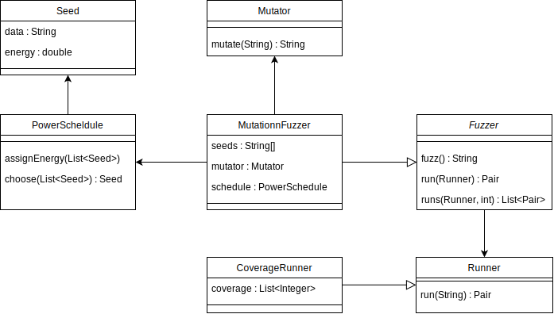

# 模糊测试工具

具备反馈机制的基于变异的模糊器

## 架构图

- `Fuzzer`：模糊器程序入口，生成输入测试给Runner执行
- `Runner`：待测程序包装类，插装待测程序并执行，分析运行结果
- `PowerSchedule`：种子调度器，实现了能量调度
- `Mutator`：变异器，使用变异算子随机生成输入内容

## 详细设计

### 插装组件

`CoverageRunner`内使用Jacoco对模糊目标`PUT`进行插装，该类内部使用`coverage`成员记录测试目标执行的行覆盖信息，反馈给`Fuzzer`以优化下一次的种子选择。

### 反馈机制

`Fuzzer`收集`Runner`运行后的`coverage`的信息，并在`PowerSchedule`记录该`coverage`出现过的次数。在下一轮循环中，`coverage`出现次数会影响`PowerSchedule`选取种子时的概率。

### 能量调度

`PowerSchedule`实现了能量调度算法，该类内部使用`assignEnergy`为每一个种子分配能量，也就是设置了种子被选取的概率。

该类内部记录了每种`coverage`出现的次数，并在选取种子时根据该种子对应的`coverage`出现次数设置能量，`coverage`出现次数越多的种子的能量将指数下降。

### 变异实现

`Mutator`类内部实现了五种变异算子，将随机选取变异算子，将选取的种子内容变异之后返回。

### 输出分析

`Runner`类将运行的崩溃信息输出至日志文件。

## References

- [Greybox Fuzzing - The Fuzzing Book](https://www.fuzzingbook.org/html/GreyboxFuzzer.html)
