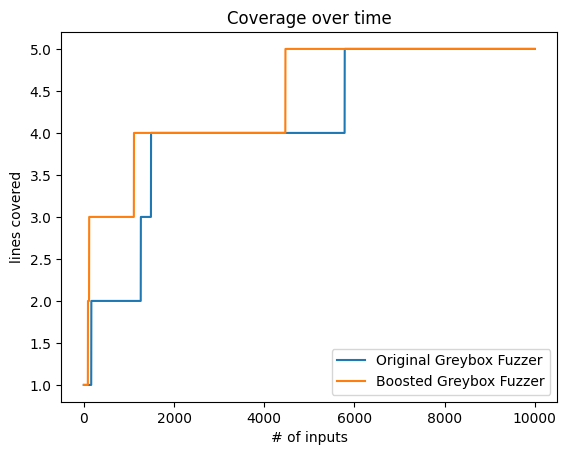

# 模糊测试工具

具备反馈机制的基于变异的模糊器

## 项目目录

```tree
├─img
├─src
│  └─main
│     └─java
├─pom.xml
└─README.md
```

- `README.md`和`img`：项目的文档说明及图片
- `src`：项目源代码
- `pom.xml`：maven配置

## 运行说明

程序入口在`MutationFuzzer`的`main`方法

## 运行截图


使用了10k个输入进行测试，初始种子为`"abc"`，可以看到模糊器的种子队列`population`一步一步接近直至触发异常的过程。下面为待测程序PUT的函数：

```java
public String test(String str) {  
    if (str.length() > 0 && str.charAt(0) == 'b') {  
        if (str.length() > 1 && str.charAt(1) == 'a') {  
            if (str.length() > 2 && str.charAt(2) == 'd') {  
                if (str.length() > 3 && str.charAt(3) == '!') {  
                    throw new RuntimeException("crashed!!");  
                }  
            }  
        }  
    }  
    return "Wrong Answer";  
}
```

## 架构图


- `Fuzzer`：模糊器程序入口，生成输入测试给Runner执行
- `MutationFuzzer`：基于变异的模糊器，使用了变异器Mutator对种子进行变异
- `Runner`：待测程序包装类，插装待测程序并执行，分析运行结果
- `CoverageRunner`：覆盖率执行器，在Runner的基础上记录了代码行覆盖率信息
- `PowerSchedule`：种子调度器，实现了能量调度
- `Mutator`：变异器，使用变异算子随机生成输入内容
- `Seed`：种子包装类，封装了每个种子的内容、能量、覆盖代码等信息

程序首先从MutationFuzzer的main方法运行，首先初始化种子Seed、种子调度器PowerSchedule和模糊器Mutator，然后选择执行待测程序的执行器CoverageRunner运行模糊测试。在一次模糊测试循环中：
1. 模糊器MutationFuzzer首先根据种子调度器PowerSchdule选择一个种子，然后使用变异器Mutator将种子变异，将变异后的输出内容传给执行器CoverageRunner执行；
2. 执行器CoverageRunner会根据输入内容运行待测程序并记录输出结果及运行异常，将结果作为函数返回返回给模糊器。同时，CoverageRunner将记录该输入内容的代码行覆盖率；
3. 模糊器根据执行器的返回结果和覆盖率信息，更改种子调度器的状态，使其优化下一轮的种子选择。至此，一轮循环结束，模糊器开始下一轮的测试。
### 功能点

- 插装组件：`CoverageRunner`内使用Jacoco对模糊目标`PUT`进行插装，该类内部使用`coverage`成员记录测试目标执行的行覆盖信息，反馈给`Fuzzer`以优化下一次的种子选择。
- 反馈机制：`Fuzzer`收集`Runner`运行后的`coverage`的信息，并在`PowerSchedule`记录该`coverage`出现过的次数。在下一轮循环中，`coverage`出现次数会影响`PowerSchedule`选取种子时的概率。
- 能量调度：`PowerSchedule`实现了能量调度算法，该类内部使用`assignEnergy`为每一个种子分配能量，也就是设置了种子被选取的概率。该类内部记录了每种`coverage`出现的次数，并在选取种子时根据该种子对应的`coverage`出现次数设置能量，`coverage`出现次数越多的种子的能量将指数下降。
- 变异实现：`Mutator`类内部实现了五种变异算子，将随机选取变异算子，将选取的种子内容变异之后返回。
- 输出分析：`Runner`类将运行的崩溃信息输出至日志文件。

## 详细设计

### Seed类

```java
public class Seed {  
    private final String data;  
    private double energy;  
    private int coverageHashCode;
}
```

Seed类封装了一个测试输入种子，其有以下三个成员属性：
- `data`：具体的种子内容
- `energy`：种子的能量，能量越高的种子在种子选择时有更高的概率被选中
- `CoverageHashCode`：该种子执行后的行覆盖信息，能量调度会根据行覆盖信息为种子设置能量

### PowerSchedule类

```java
public class PowerSchedule {  
    private HashMap<Integer, Integer> frequency = new HashMap<>();
	
	public void assignEnergy(List<Seed> population) {  
	    // Assign exponential energy inversely proportional to path frequency
	}
	
	public Seed choose(List<Seed> population) { ... }
}
```

PowerSchedule类使用能量调度来完成种子的选择，其有一个成员`frequency`，用于记录每个行覆盖信息出现的次数，然后在`assignEnergy`方法中根据`frequency`为每个种子设置能量。

能量调度的目标是希望给那些能发现更多行覆盖的种子分配更多的能量，因此，对于那些出现次数多的行覆盖对应的种子，应该给其分配相对少的能量。这里是假设使用一个行覆盖出现次数多的种子作为输入时，其运行后发现新的代码行的概率小，而使用那些行覆盖出现次数少的种子更有可能执行到新的代码行。实际测试时也发现这样做确实可以更有效的发现新的行覆盖。所以，我们根据行覆盖出现次数的指数的倒数设置一个种子的能量，代码如下：

```java
seed.setEnergy(1 / Math.pow(frequency.get(seed.getCoverageHashCode()), 5)); 
```

使用该能量调度方法与等概率选取种子的对比（图源The Fuzzing Book[^1]）：


### Mutator类

Mutator类内实现了五种变异算子。为了保证每一轮循环的测试效果，应尽量多的使用算子，并且尽量与原有内容相似，因此每一次变异会选取多个算子但每个算子的变异幅度较小。在主方法`mutate`中，对于基本算子操作，限制了只能使用`Havoc`算子来多次使用基础算子；切片操作不影响，但调低了切片操作发生概率：

```java
public String mutate(String inp) {  
    current = new StringBuilder(inp);  
  
    int way = random.nextInt(4);  
    if (way == 0) {  
        Splice();  
    } else {  
        Havoc();  
    }  
  
    last = current.toString();  
    return last;  
}

public void Havoc() {  
    for (int i = 0; i < random.nextInt(5); i++) {  
        int way = random.nextInt(3);  
        switch (way) {  
            case 0:  
                CharFlip();  
                break;  
            case 1:  
                CharIns();  
                break;  
            case 2:  
                CharDel();  
                break;  
        }  
    }  
}
```

而在基础算子中，限制了算子的参数大小。下面以`CharFlip`作为例子，该例中，每次翻转的字符数量限制为1个，翻转的总次数最大为字符串长度：

```java
public void CharFlip() {  
    CharFlip(random.nextInt(127 - 32), random.nextInt(current.length()), 1);  
}
```

### MutationFuzzer类

```java
public class MutationFuzzer implements Fuzzer {
	public MutationFuzzer(String[] seeds, Mutator mutator, PowerSchedule schedule){
		this.seeds = seeds;  
		this.mutator = mutator;  
		this.schedule = schedule;  
		  
		inputs = new ArrayList<>();  
		reset();
	}
	
	@Override  
	public String fuzz() { ... }
	
	@Override  
	public Pair<String, String> run(Runner runner) { ... }
}
```

MutationFuzzer类使用三个参数完成初始化：初始种子队列`seeds`，变异器`mutator`，能量调度器`schdule`。它还实现了Fuzzer接口类的`fuzz`方法和`run`方法，并且维护一个自己感兴趣的种子队列`population`

`fuzz`方法即生成一个模糊测试输入，其会先将初始种子队列中的种子顺序作为输入，然后开始执行种子变异的过程。种子的变异过程具体分为两步：1）使用能量调度器`schedule`从种子队列`population`中选取一个种子；2）使用变异器`mutator`将种子变异，返回变异结果。

```java
public String fuzz() {  
    // Returns first each seed once and then generates new inputs  
  
    if (seed_index < seeds.length) {  
        // Still seeding  
        inp = seeds[seed_index++];  
    } else {  
        // Mutating  
        inp = mutator.mutate(schedule.choose(population).getData());  
    }  
    inputs.add(inp);  
    return inp;  
}
```

`run`方法中会调用`fuzz`方法生成一个输入给`runner`运行，然后基于运行结果反馈做出调整。具体来说，它会在`schedule`的`frequency`成员中将这次运行的行覆盖的计数加一，然后如果发现了新的行覆盖，那么它还会将该输入添加到种子队列`population`中供后续使用。

```java
public Pair<String, String> run(Runner runner) {  
    // Inform scheduler about path frequency  
    Pair<String, String> result = Fuzzer.super.run(runner);  
  
    HashMap<Integer, Integer> frequency = schedule.getFrequency();  
    int hashCode = ((CoverageRunner) runner).getCoverage().hashCode();  
    if (frequency.containsKey(hashCode)) {  
        frequency.put(hashCode, frequency.get(hashCode) + 1);  
    } else {  
        frequency.put(hashCode, 1);  
  
        Seed s = new Seed(inp);  
        s.setCoverageHashCode(hashCode);  
        population.add(s);  
    }  
  
    return result;  
}
```

### CoverageRunner类

使用Jacoco[^2]对代码进行了插装，以统计代码的运行时信息。该类内部使用`coverage`成员变量记录了此次运行的行覆盖信息。

```java
// Let's dump some metrics and line coverage information:  
coverage.clear();  
for (final IClassCoverage cc : coverageBuilder.getClasses()) {  
    for (int i = cc.getFirstLine(); i <= cc.getLastLine(); i++) {  
        int status = cc.getLine(i).getStatus();  
        if (status == ICounter.PARTLY_COVERED || status == ICounter.FULLY_COVERED) {  
            coverage.add(i);  
        }  
    }
```

Runner中定义了测试运行后的状态：
- `PASS`：待测程序正常执行返回结果
- `FAILED`：待测程序执行引起异常，其执行结果被捕获
- `UNSOVLED`：待测程序之外引发的错误

CoverageRunner运行后，会将待测程序返回结果与运行状态一并返回。并且当测试执行引起异常时，CoverageRunner还会记录引发异常的输入和异常信息，打印内容到指定输出`out`

```java
@Override  
public Pair<String, String> run(String inp) {  
    param = inp;  
  
    String k, v;  
    try {  
        k = this.execute();  
        v = PASS;  
    } catch (Exception e) {  
        k = e.toString();  
        v = FAIL;  
        try {  
            out.write(("input: " + param + "\n").getBytes(StandardCharsets.UTF_8));  
            out.write((k + "\n\n").getBytes(StandardCharsets.UTF_8));  
            out.flush();  
        } catch (IOException ioException) {  
            ioException.printStackTrace();  
        }  
    }  
    return new Pair<>(k, v);  
}
```

## References

[^1]: [Greybox Fuzzing - The Fuzzing Book](https://www.fuzzingbook.org/html/GreyboxFuzzer.html)
[^2]: [JaCoCo - API Usage Examples](https://www.jacoco.org/jacoco/trunk/doc/api.html)
